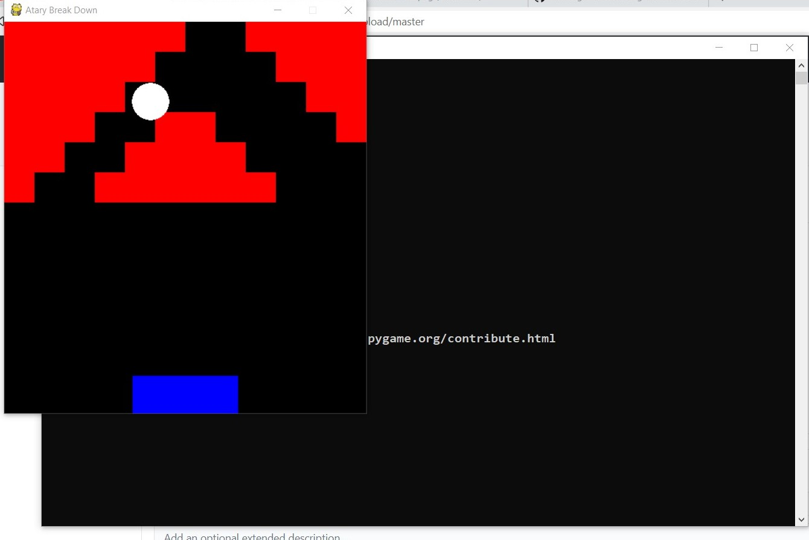

# Atary Breakdown

### How to run on your local machine
#### Download the source Code

1. First install pygame

1. open CMD/Terminal
* On Windows
- Enter "pip install pygame"
* On Linux/Unix
- Enter "pip3 install pygame"

2. Go to project folder 
* On windows	
- Enter "python Main.py"
* On Linux/Unix
- Enter "python3 Main.py"
