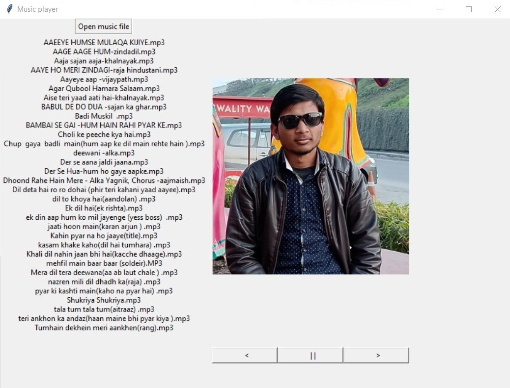

# Music player

### How to run on your local machine
#### Download the source Code

##TKinter
> Previously We have to manualy install
>Tkinter but now it comes preinstall 
> with python,But it is options so
>make sure while installing python
>check the tcl/tk option

1. First install pygame,Tkinter
  * open CMD/Terminal
    * On Windows
      -Enter "pip install requirements.txt"
    * On Linux/Unix
      -Enter "pip3 install requirements.txt" 

2. Go to project folder 
  * On windows	
    - Enter "python music_player.py"
  * On Linux/Unix
    - Enter "python3 music_player.py"
